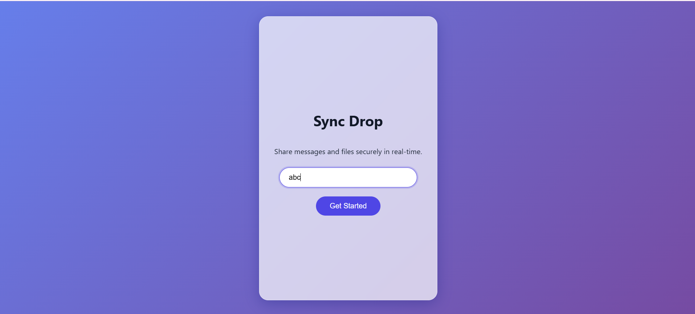
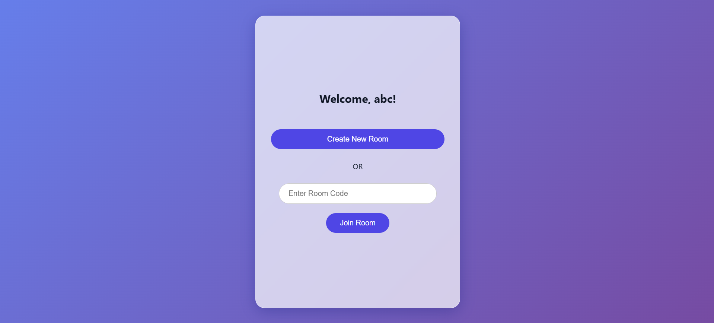
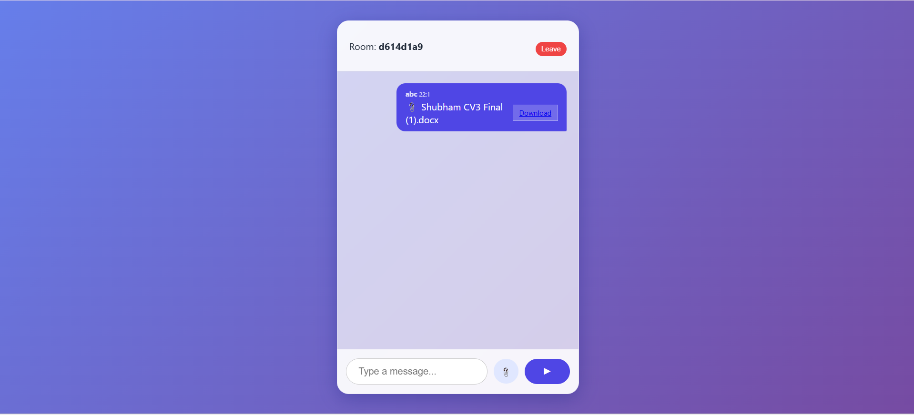
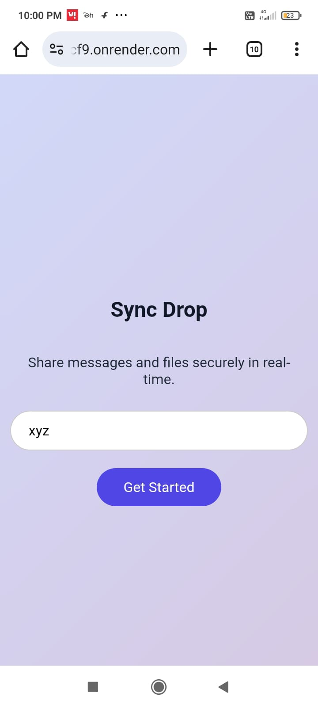
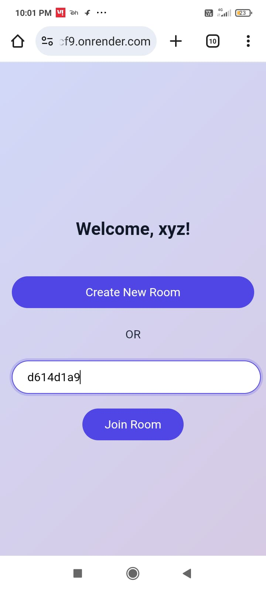
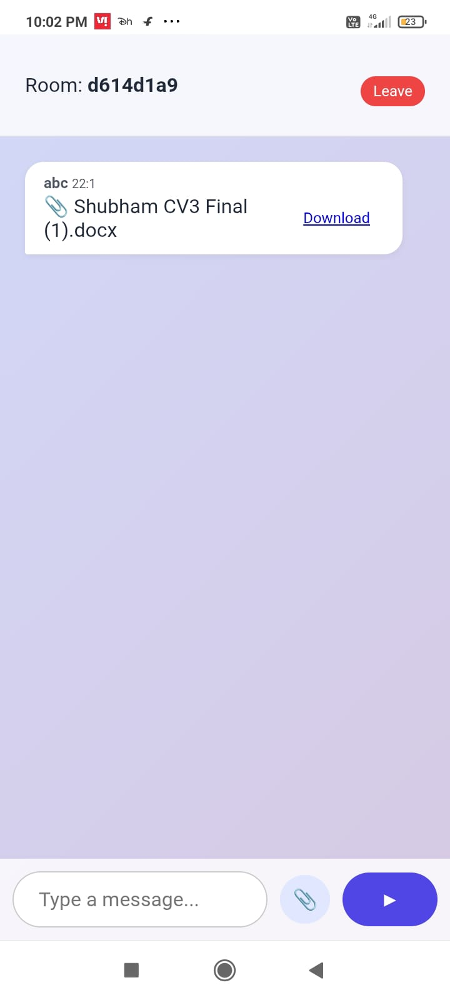

# QuickFileShare (SyncDrop)

> **Share messages and files securely in real-time.**
> *No database. No sign-ups. Just instant, private sharing.*

## 🚀 Overview
QuickFileShare is a **Real-Time File Sharing & Chat Application**. It allows users to create private "rooms" and share text messages, documents, and images instantly.
It is built with a focus on **Privacy and Speed**. The server is completely stateless—files are streamed directly from sender to receiver through the server's RAM and are never stored on a hard disk.

## 📸 How It Works (Workflow)

### 🖥️ Desktop Experience

#### 1. Welcome Screen
Enter your username to get started with a clean interface.

#### 2. Create or Join Room
Generate a unique Room ID or enter an existing one to join a secure session.

#### 3. 📍 Find People Nearby (New!)
Click **"Find People Nearby"** to automatically discover other users on your same WiFi network. Connect instantly without typing a Room ID.

#### 4. Chat & File Sharing
Chat in real-time and share files instantly with connected users.

### 📱 Mobile Experience

#### Seamless Mobile Interface
The application is fully responsive. Here is the flow on mobile devices:

**1. File Sharing & Chat Interface**

**2. Joining a Room**

**3. Welcome Screen**

---

## 🛠️ Tech Stack
*   **Frontend:** React.js, Vite, CSS (Modules)
*   **Backend:** Node.js, Express.js
*   **Real-Time:** Socket.io (WebSockets)
*   **Security:** UUID for unique room generation, CORS for secure cross-origin requests.

## 💡 Key Features
*   **⚡ Zero Latency:** Uses In-Memory transfer for instant speed.
*   **🔒 High Privacy:** No database. Files are wiped from RAM immediately after transfer.
*   **📂 Large File Support:** Optimized for files up to 10MB (images, PDFs, docs).
*   **📱 Responsive Design:** Works seamlessly on Desktop and Mobile.

## 🏗️ Deployment
The project is deployed as a **Single Service Monolith** on **Render**.
- The backend serves the production-ready React frontend static files.
- **Port:** Automatically managed via `process.env.PORT`.

---
*Built by Shubham.*
